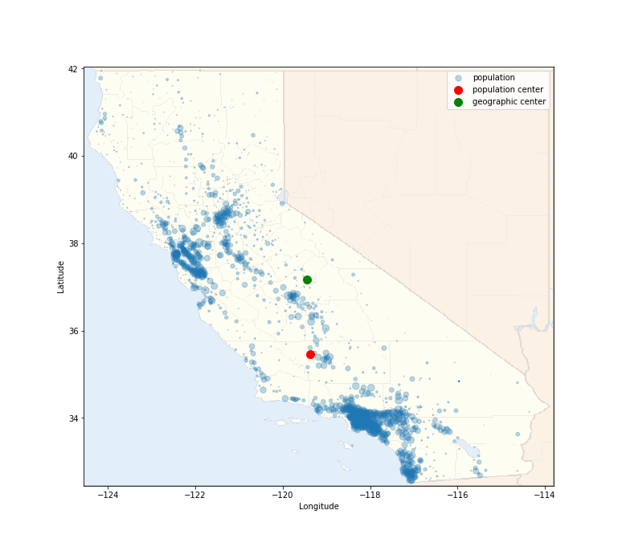
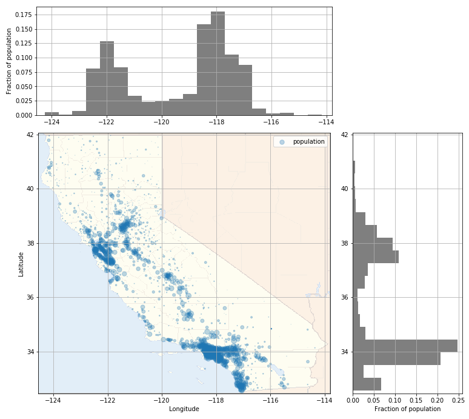

## Where is the center of California?

It depends what you mean by "center".

The geographic center, as listed [here](https://en.wikipedia.org/wiki/List_of_geographic_centers_of_the_United_States), is in Madera County, close to Fresno.

What about the "center" of population? As of 2020, it's much closer to Bakersfield:

This surprised me. It turns out that half of California's 38 million people live in the LA area! Only 20% of the state lives in the Bay Area, and less than 5% live north of Sacramento.

If you're curious, check out [the full analysis](https://nbviewer.jupyter.org/github/marwahaha/ca-center/blob/main/data_processing.ipynb). I also made a [map for every state](https://marwahaha.github.io/ca-center/viewer). [Here's that analysis](https://nbviewer.jupyter.org/github/marwahaha/ca-center/blob/main/multi_state.ipynb).

The data is from [OpenDataSoft](https://public.opendatasoft.com/explore/dataset/us-zip-code-latitude-and-longitude/table/?refine.state=CA
) and [World Population Review](https://worldpopulationreview.com/zips/california).
